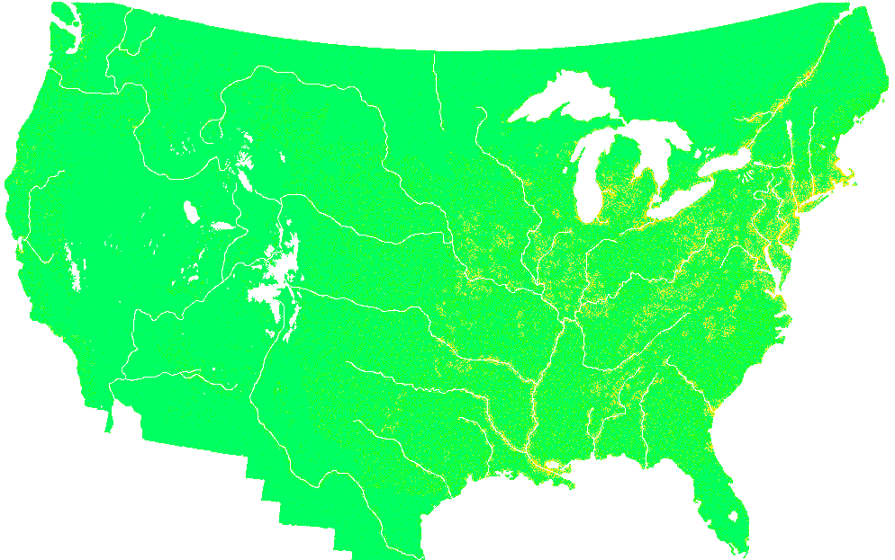

# Manifest Destiny

*Manifest Destiny* is a population growth simulator.  It is based on a cellular automata model of the United States during its period of rapid Westward expansion from 1763 to 1863.  It is implemented in *C* and uses MPI for both parallel processing and parallel I/O.  Additionally, it uses CUDA to leverage the power of GPUs for the simulation.

## Results



*Manifest Destiny* is able to produce accurate a simulation of population growth and distribution within tens of percentage points of historical values.

Our simulation can also take advantage of high-performance computing resources to run simulations in a fraction of the time it would take to run serially.  We can simulate 1000 simulation iterations in less than 10 seconds when utilizing all available resources.

## Quisk Start

Running *Manifest Destiny* requires several quick steps:

1. Create an input array using the `Python` helper script.
    * Different resolutions can be created by changing the `--resolution_scale` parameter.  The default is 1.
   ```bash
    python scripts/visualize_data.py export data/img/usa_cities_1763_iso.png out/1763_3.npy --resolution_scale 1
   ```
   
2. Compile the code using `make`.
    * This will place the compiled binary in the `./bin/` directory.
    ```bash
    make release # compile the code with optimizations
    ```
   
3. Run the simulation using `mpirun`.
    * This will create a new output file in the `./out/` directory called `out/1763_out_<ckpt_iters>.npy` for each checkpoint, where `<ckpt_iters>` is the number of iterations at each saved checkpoint.
    ```bash
    mpirun -np <num_processes> ./bin/manifest out/1763_3.npy out/1763_out.npy <iterations> <ckpt_iters>
    ```

4. Import the simulation output using the `Python` helper script.
    * This will create a new image in the `./data/img/` directory called `1763_output_<ckpt_iters>.png`.  This image is an easy way to visually inspect the output of the simulation.
    ```bash
    python scripts/visualize_data.py import out/1763_out_<ckpt_iters>.npy out/1763_output_<ckpt_iters>.png --resolution_scale 1
    ```
   
5. Tally the total population using the `Python` helper script.
    * This will print the total population of the simulation.
    ```bash
    python scripts/visualize_data.py tally out/1763_out_<ckpt_iters>.npy
    ```